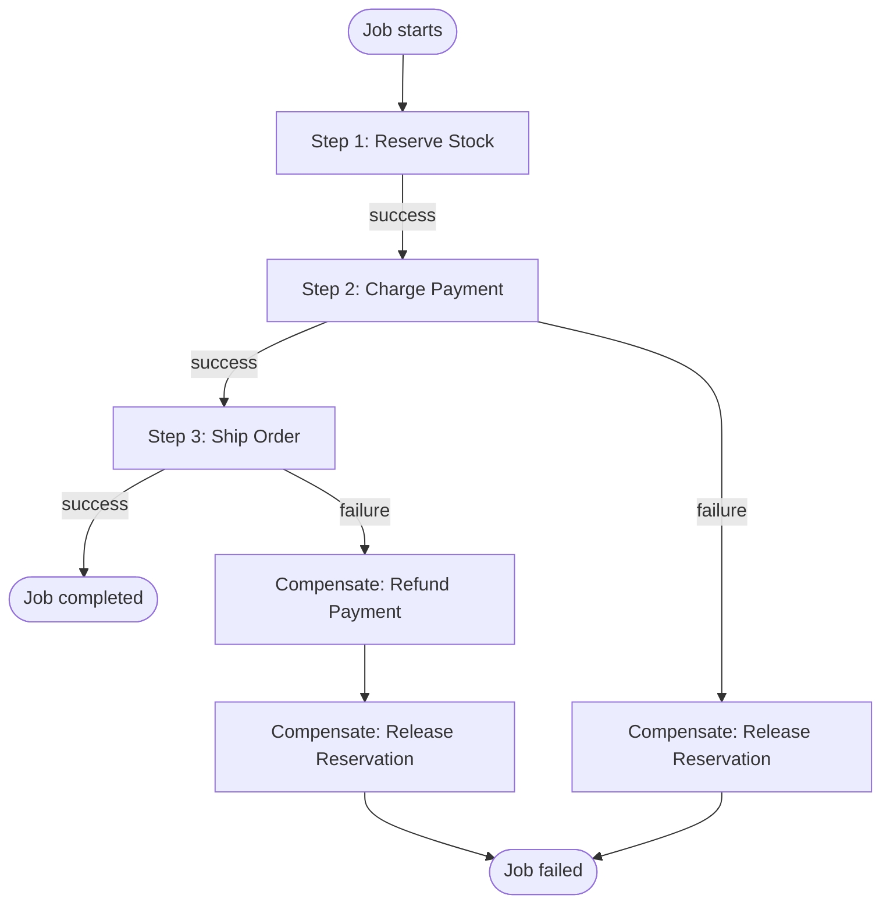

Implements the Saga pattern for multi-step workflows where each step has a compensation action that runs on failure.

## Flow



## Setup

First, generate the project:

<Command variant="exec">
  create-vorsteh-queue my-app --template=workflow-saga
</Command>

Then install dependencies and start the dev server:

```bash
cd my-app
pnpm install
pnpm dev
```

## What it demonstrates

- Multi-step workflow orchestration
- Compensation actions for rollback
- Step-by-step execution with error boundaries
- Distributed transaction patterns without 2PC

## Related documentation

- [Flows Overview](/docs/vorsteh-queue/core/flows/overview)
- [Steps](/docs/vorsteh-queue/core/flows/steps)
- [Error Handling](/docs/vorsteh-queue/core/error-handling)

## Source

[View on GitHub](https://github.com/noxify/vorsteh-queue/tree/main/examples/workflow-saga)
