Demonstrates workflows that pause and wait for external signals (e.g. human approval, webhook callback) before continuing.

## Flow

```mermaid
sequenceDiagram
    participant E as Employee
    participant Q as Queue
    participant W as Worker
    participant M as Manager

    E->>Q: Add expense-request job
    Q->>W: Pick up job
    W->>W: Step 1: Submit expense
    W-->>Q: Pause (waitFor "manager-decision")

    Note over W,M: Job is suspended, waiting for signal

    M->>Q: queue.signal(jobId, "manager-decision", { approved })
    Q->>W: Resume job with signal data
    W->>W: Step 2: Process decision
    W-->>Q: Job completed
```



## Setup

First, generate the project:

<Command variant="exec">
  create-vorsteh-queue my-app --template=workflow-signals
</Command>

Then install dependencies and start the dev server:

```bash
cd my-app
pnpm install
pnpm dev
```

## What it demonstrates

- `waitFor` signal mechanism
- Pausing a workflow until external input arrives
- Human-in-the-loop approval patterns
- Signal timeout handling

## Source

[View on GitHub](https://github.com/noxify/vorsteh-queue/tree/main/examples/workflow-signals)
